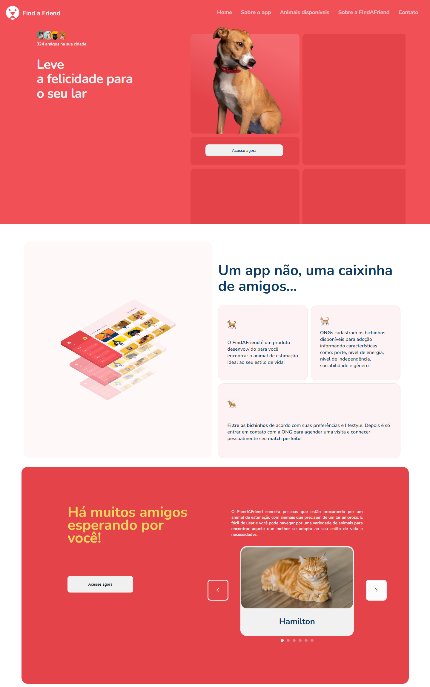

# Finde a Friend

Projeto de layout de uma instituição de adoração de animais

  
<a href="https://www.figma.com/file/V3OhnxaFrPSppQwOdXlgyC/GCC-%231---FindAFriend-(Community)?node-id=1-147&t=Z11lADWaamxTJmRJ-0">- Figma</a>

## 🚀 Tecnologias

Esse projeto foi desenvolvido com as seguintes tecnologias:

- HTML e CSS
- JavaScript

 <h3 align="center"> Developed by <a href="https://www.linkedin.com/in/gabriel-santos-bb4a10188/">Gabriel Santos</a> ☕</h3>
